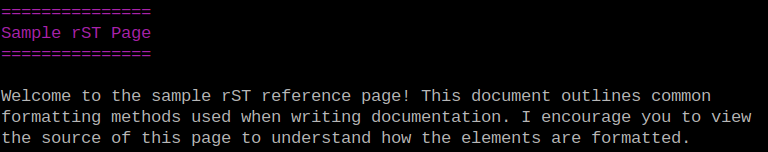

===============
Sample rST Page
===============

Welcome to the sample rST reference page! This document outlines common
formatting methods used when writing documentation. I encourage you to view
the source of this page to understand how the elements are formatted.

Table of Contents
-----------------

#. `Titles`_
#. `Links`_
#. `Bulleted lists`_
#. `Adding screenshots`_
#. `Text formatting`_

---------------------

|

Titles
------

Titles can be created by typing the title name followed by placing certain
symbols below the title.

For example::

    This is a title
    ---------------

I recommend ensuring the length of the line under the title matches the length
of the title.

|

You can use a number of symbols to create a title::

    =================

    -----------------

    +++++++++++++++++

    ~~~~~~~~~~~~~~~~~

The first symbol used as a title will have the largest font. All title symbols
used after will be slightly smaller than the largest one.

|

Subtitle
~~~~~~~~

For example, this is a subtitle of the "Titles" section and uses the ``~``
symbol to create the subtitle.

---------------------

|

Links
-----

External and internal linking is supported.

Create an external link
~~~~~~~~~~~~~~~~~~~~~~~

To create an external link, use the form::

    `Link name <hyperlink target>`_

Example syntax::

    Find out more about InMotion's `Private Cloud <https://www.inmotionhosting.com/cloud/private/hosted>`_ in the Support Center.

|

Here's how the above syntax would appear after being parsed:

Find out more about InMotion's `Private Cloud <https://www.inmotionhosting.com/cloud/private/hosted>`_ in the Support Center.

|

Create an internal link
~~~~~~~~~~~~~~~~~~~~~~~

Example linking to this repository's README::

    For information on the purpose of this repository, take a look at the `README <README.rst>`_.

Now parsed:

For information on the purpose of this repository, take a look at the `README <README.rst>`_.

|

Bulleted lists
--------------

Lists in rST can be bulleted, start with numbers, and be nested.

Example syntax showing both bullets and numbered lists::

    List of webservers

    * Apache
    * NGINX
    * Tomcat

    -----------------

    Procedure

    #. Start here
    #. Now do this
    #. Finally, do...

|

The above, parsed:

List of webservers

* Apache
* NGINX
* Tomcat

-----------------

Procedure

#. Start here
#. Now do this
#. Finally, do...

|

Adding screenshots
------------------

You will need to make use of an rST `directive <https://docutils.sourceforge.io/docs/ref/rst/directives.html>`_ to include screenshots.

To add screenshots, use the ``image`` directive::

    .. image:: images/screenshot_1.png

|

The above, now parsed:

|

Text formatting
---------------

A variety of text formatting features are available:

* **Bold**
* *Italics*
* ``inline code``

|

Here's the rST for the above::

    * **Bold**
    * *Italics*
    * ``inline code``

Take note of each symbol used to create the desired effect.

|

Code blocks
~~~~~~~~~~~

Code blocks can be created by ending a line with, ``::``, inserting a blank
line after the colons, then indent and insert the code block text. The indent
must remain consistent.

Example using rST::

    Echo text using bash::

        $ echo 'Hello World!'

|

The above parsed:

Echo text using bash::

    $ echo 'Hello World!'

Page and line breaks
~~~~~~~~~~~~~~~~~~~~

To create a horizontal line, include a series of dashes (``-``) all on one
line::

    ---------------------

Example line break:

---------------------

To add whitespace in between text or items create a new line with the ``|``
symbol.

Example:

Text

|

More text

|

The end.

---------------------
